# UML Diagrams - Sentiment Analysis System

This document contains UML diagrams describing the system architecture, data flow, and component interactions. Diagrams use Mermaid syntax and can be rendered in GitHub, VS Code, or online tools like [Mermaid Live](https://mermaid.live).

---

## 1. System Architecture Diagram

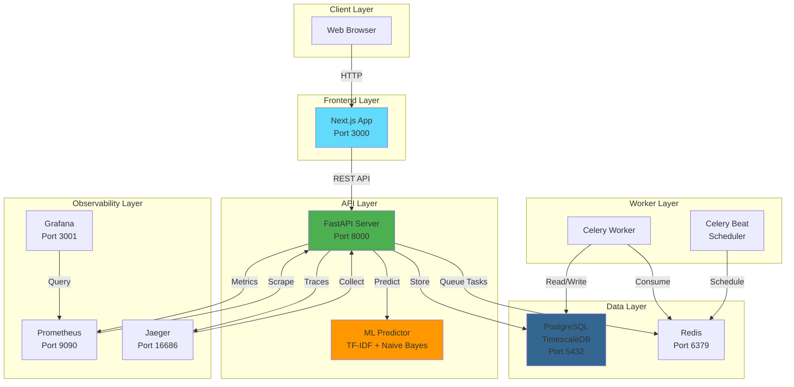

---

## 2. Sequence Diagram - Sentiment Analysis Flow

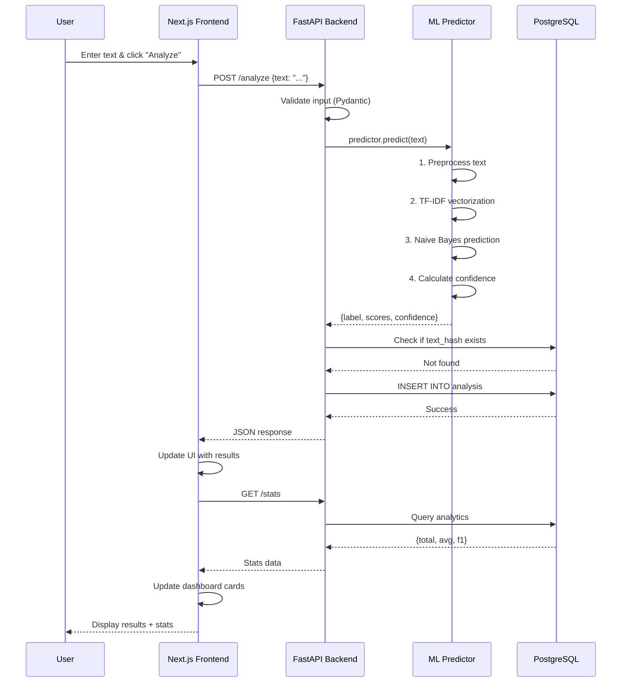

---

## 3. Class Diagram - Database Models

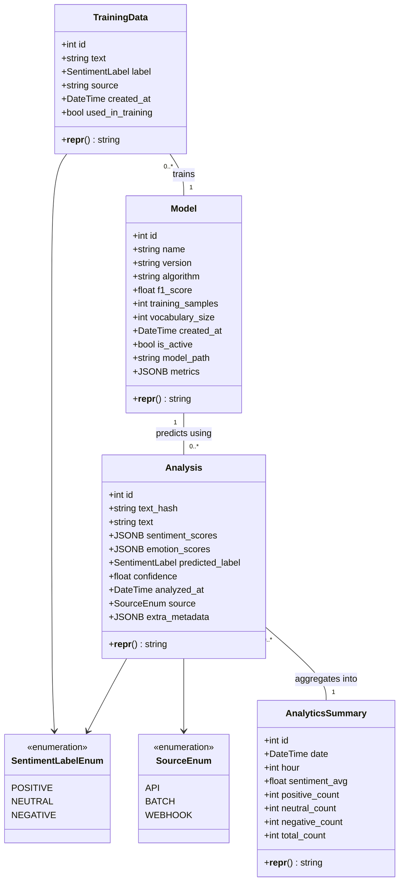

---

## 4. Component Diagram - ML Pipeline

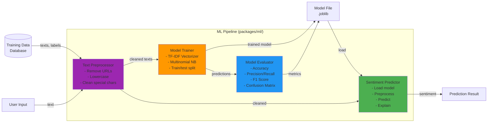

---

## 5. Activity Diagram - Model Training Workflow

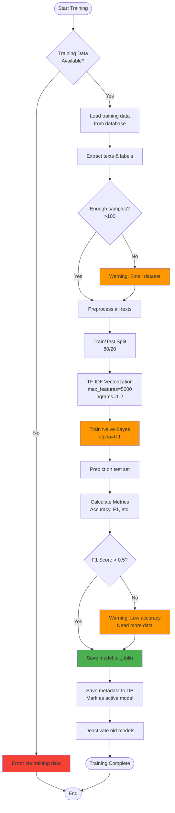

---

## 6. Deployment Diagram - Production Architecture

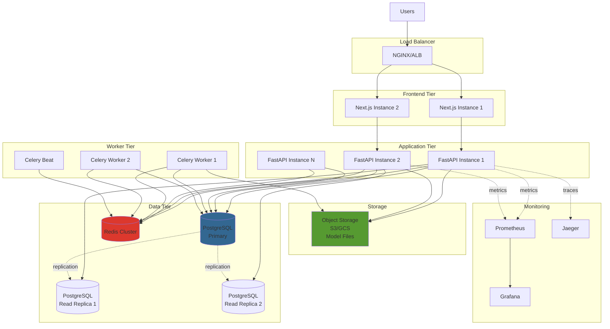

---

## 7. State Diagram - Analysis Lifecycle

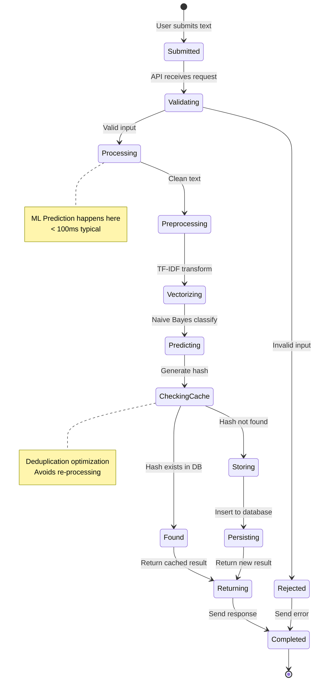

---

## 8. Use Case Diagram - User Interactions

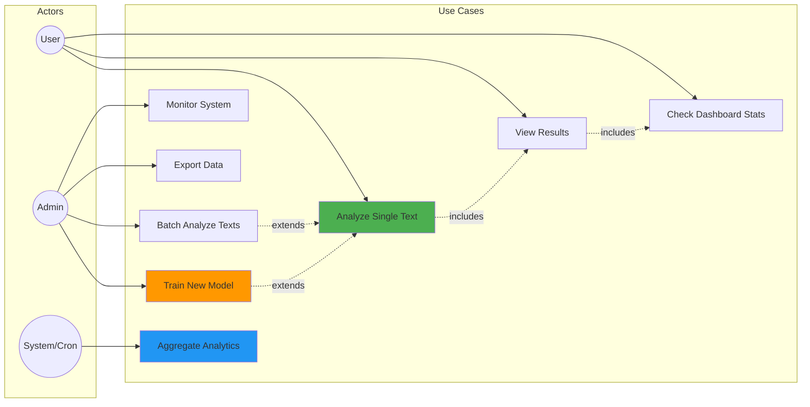

---

## 9. Data Flow Diagram - End-to-End

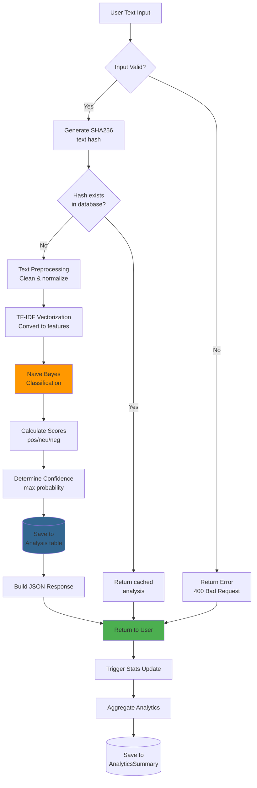

---

## 10. Entity-Relationship Diagram (ERD)

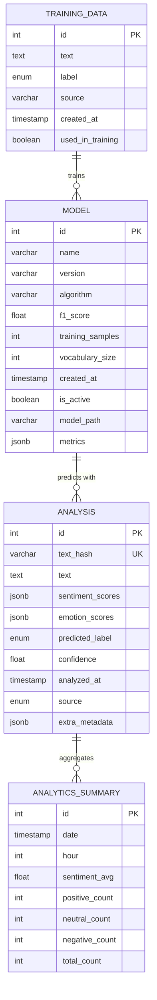

---

## 11. Package Diagram - Code Organization

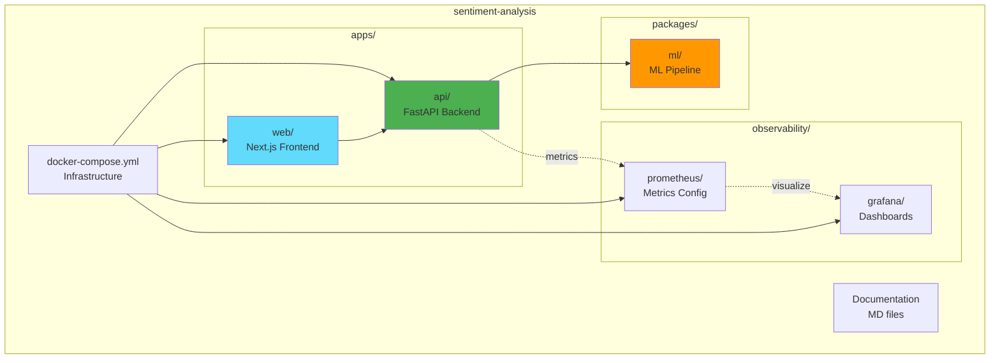

---

## Rendering Instructions

### GitHub
These diagrams will render automatically when viewing this file on GitHub.

### VS Code
Install the "Markdown Preview Mermaid Support" extension.

### Online
Copy diagram code to [Mermaid Live Editor](https://mermaid.live).

### Export
Use Mermaid CLI or online tools to export as PNG/SVG:
```bash
npm install -g @mermaid-js/mermaid-cli
mmdc -i UML_DIAGRAMS.md -o diagrams.pdf
```

---

## Legend

| Color | Meaning |
|-------|---------|
| 🟢 Green | Success/Active/Primary |
| 🔵 Blue | Processing/Analytics |
| 🟠 Orange | ML/AI Components |
| 🔴 Red | Errors/Warnings |
| ⚪ Gray | Neutral/Data |

| Symbol | Meaning |
|--------|---------|
| → | Data flow |
| -.-> | Metrics/Monitoring |
| -->> | Response |
| <--> | Bidirectional |

---

**Generated:** 2025-01-08
**Version:** 1.0.0
**Maintainer:** System Architecture Team
